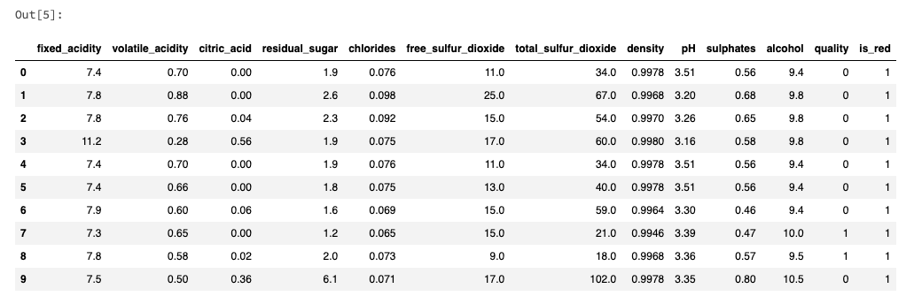
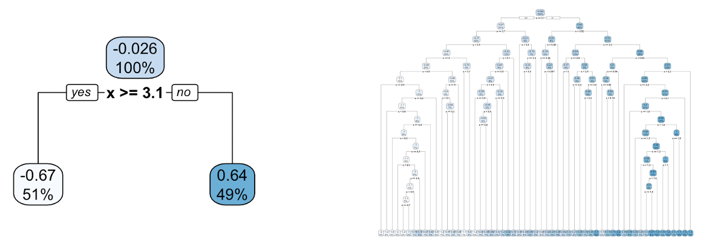
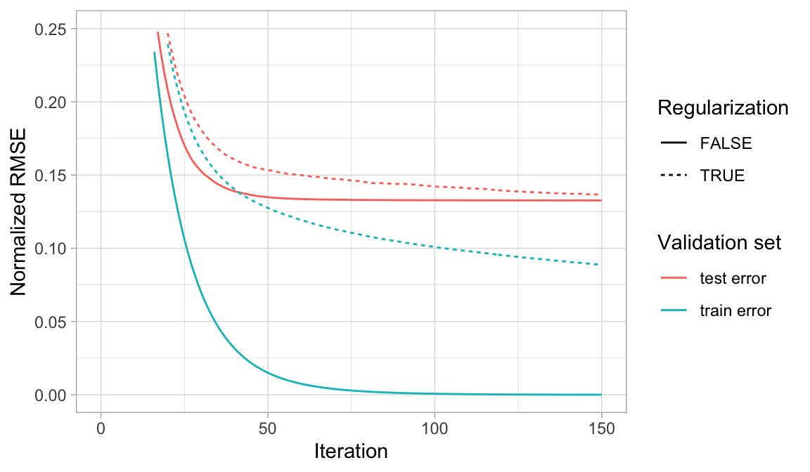
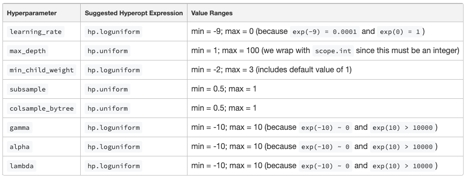
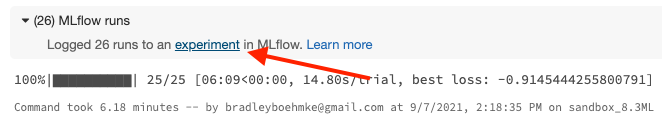
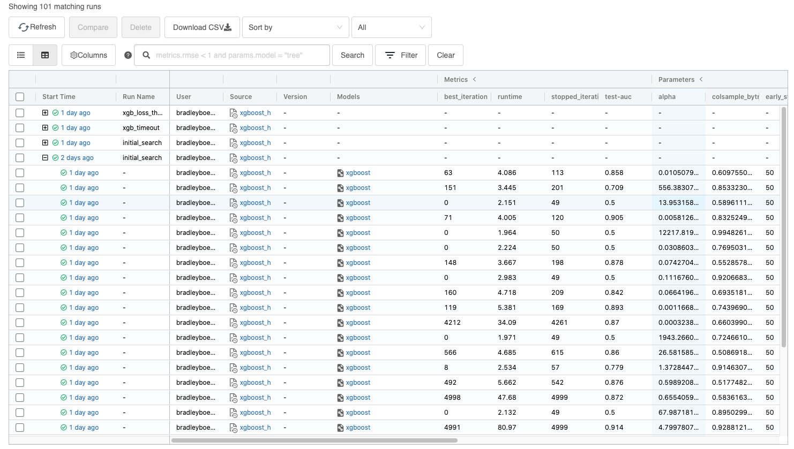
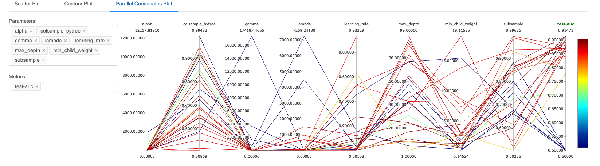
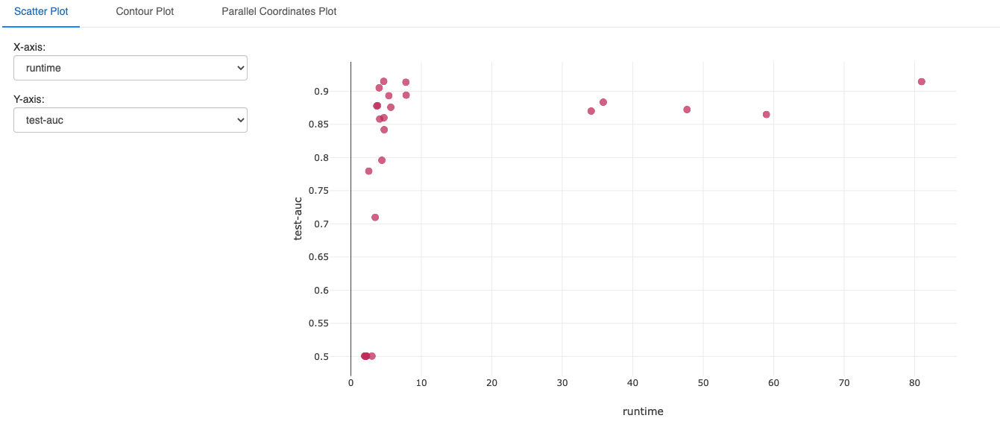

# Advanced XGBoost Hyperparameter Tuning on Databricks

 

September 9, 2021

       

Brad Boehmke

Slides: [bit.ly/xgb_db_tuning](https://bit.ly/xgb_db_tuning)

Tutorial Docs: [bit.ly/db_notebook_docs](https://bit.ly/db_notebook_docs)

---

## Agenda

1. Tutorial objective
2. Why this topic?
3. Where it fits in current offerings
4. Assumptions made
5. Tutorial
6. My approach
7. Q&A

---

# Tutorial objective

 

Advanced XGBoost Hyperparameter Tuning on Databricks

  

Objective:

* Best practices for tuning XGBoost hyperparameters
* Using tightly coupled Databricks tooling for...  
&nbsp;&nbsp;&nbsp;- Effective and efficient scaling of XGBoost hyperparameter search (Hyperopt) 
&nbsp;&nbsp;&nbsp;- Tracking and organizing grid search performance (MLFlow)

---

# Why this topic?

* Demand (insider <strike>trading</strike> information)
* Disparate information
* Centralization & tighter coupling
* Interest
* Leverage expertise to shorten learning curve

---

# Where it fits

* https://docs.databricks.com/applications/machine-learning/train-model/machine-learning.html#xgboost
* Designed to be a standalone tutorial guide that builds on top of the standard usage guides while showing how to scale out hyperparameter tuning with Databricks centric tooling

---

# Asumptions made

This tutorial makes the assumption that the reader:

* <b>Time</b>: Plans to spend ~ 10min reading the tutorial (< 3,000 words)
* <b>Language</b>: Comfortable using Python for basic data wrangling tasks, writing functions, and applying context managers
* <b>ML</b>: Understands the basics of the GBM/XGBoost algorithm and is familiar with the idea of hyperparameter tuning
* <b>Environment</b>: Has access to a Databricks ML runtime cluster to reproduce results (~ 20 min compute time)

<b>Target audience</b>: Data scientist transitioning to Databricks that has experience with machine learning in general and, more specifically, some experience with XGBoost. The reader's objective is to better understand what XGBoost hyperparameters to focus on, what values to explore, and how best to implement this process within Databricks.

---

# (Abridged) Tutorial

---
# Intro

Gradient boosting machines (GBMs), and more specifically the XGBoost variant, is an extremely popular machine learning algorithm that has proven successful across many domains and, ___when appropriately tuned___, is one of the leading algorithmic methods for tabular data.

Objective of this tutorial is to illustrate:

* Best practices for tuning XGBoost hyperparameters
* Leveraging Hyperopt for an effective and efficient XGBoost grid search
* Using MLflow for tracking and organizing grid search performance

  

Note: These slides accompany a full length tutorial guide that can be found [here](https://bit.ly/db_notebook_docs).

---

# Assumptions

1. <b>Language</b>: Comfortable using Python for basic data wrangling tasks, writing functions, and applying context managers
2. <b>ML</b>: Understands the basics of the GBM/XGBoost algorithm and is familiar with the idea of hyperparameter tuning
3. <b>Environment</b>: Has access to a Databricks ML runtime cluster to reproduce results (~ 20 min compute time)

---

# Prerequisites: Packages

    !python
    # helper packages
    import pandas as pd
    import numpy as np
    import time
    import warnings

    # modeling
    from sklearn.metrics import roc_auc_score
    from sklearn.model_selection import train_test_split
    import xgboost as xgb

    # hyperparameter tuning
    from hyperopt import fmin, tpe, hp, SparkTrials, STATUS_OK
    from hyperopt.pyll import scope

    # model/grid search tracking
    import mlflow

---

# Prerequisites: Data

Well known [wine quality dataset](https://archive.ics.uci.edu/ml/datasets/wine+quality) provided by the [UCI Machine Learning Repository](https://archive.ics.uci.edu/ml/index.php).

Our objective in this modeling task is to use wine characteristics in order to predict the ___quality___ of the wine high quality(>= 7) or low quality (< 7).

    !python
    # 1. read in data
    white_wine = pd.read_csv("https://archive.ics.uci.edu/ml/machine-learning-databases/wine-quality/winequality-white.csv", sep=";")
    red_wine = pd.read_csv("https://archive.ics.uci.edu/ml/machine-learning-databases/wine-quality/winequality-red.csv", sep=";")

    # 2. create indicator column for red vs. white wine
    red_wine['is_red'] = 1
    white_wine['is_red'] = 0

    # 3. combine the red and white wine data sets
    data = pd.concat([red_wine, white_wine], axis=0)

    # 4. remove spaces from column names
    data.rename(columns=lambda x: x.replace(' ', '_'), inplace=True)

    # 5. convert "quality" column to 0 vs. 1 to make this a classification problem
    data["quality"] = (data["quality"] >= 7).astype(int)

---

# Prerequisites: Data

    !python
    data.head(10)

    !python
    # split data into train (75%) and test (25%) sets
    train, test = train_test_split(data, random_state=123)
    X_train = train.drop(columns="quality")
    X_test = test.drop(columns="quality")
    y_train = train["quality"]
    y_test = test["quality"]

    # create XGBoost DMatrix objects
    train = xgb.DMatrix(data=X_train, label=y_train)
    test = xgb.DMatrix(data=X_test, label=y_test)

---

# XGBoost hyperparameters

There are many 😳 but the most common ones can be categorized as...

* <b>Boosting hyperparameters</b>: controls how we proceed down the [gradient descent process](https://bradleyboehmke.github.io/HOML/gbm.html#gbm-gradient) (aka gradient boosting)
* <b>Tree hyperparameters</b>: controls how we build our base learner decision trees
* <b>Stochastic hyperparameters</b>: controls how we randomly subsample our training data during the model building process
* <b>Regularization hyperparameters</b>: controls model complexity to guard against overfitting

---

# Boosting hyperparameters

* <strike>Number of trees</strike>: XGBoost allows us to apply early stopping. We simply need enough trees to minimize loss.
* <b>learning_rate</b>: Determines the contribution of each tree on the final outcome and controls how quickly the algorithm learns. __Recommendation__: Search across values ranging from 0.0001-1 on a log scale (i.e. 0.0001, 0.001, 0.01, 0.1, 1).

---

# Tree hyperparameters

* <b>max_depth</b>: Explicitly controls the depth of the individual trees. __Recommendation__: Uniformly search across values ranging from 1-10 but be willing to increase the high value range for larger datasets.
* <b>min_child_weight</b>: Implicitly controls the complexity of each tree by requiring the minimum number of instances (measured by [hessian](https://stats.stackexchange.com/questions/317073/explanation-of-min-child-weight-in-xgboost-algorithm) within XGBoost) to be greater than a certain value for further partitioning to occur. __Recommendation__: Uniformly search across values ranging from near zero-20 but be willing to increase the high value range for larger datasets.

---

# Stochastic hyperparameters

Stochastic behavior helps to reduce tree correlation and also helps reduce the chances of getting stuck in local minimas, plateaus, and other irregular terrain of the loss function.

* <b>subsample</b>: Subsampling rows before creating each tree. Useful when there are dominating features in your dataset. __Recommendation__: Uniformly search across values ranging from 0.5-1.0.
* <b>colsample_bytree</b>: Subsampling of columns before creating each tree (i.e. mtry in random forests). Useful for large datasets or when multicollinearity exists. __Recommendation__: Uniformly search across values ranging from 0.5-1.0.
* <b>colsample_bylevel & colsample_bynode</b>: Additional procedures for sampling columns as you build a tree. Useful for datasets with many highly correlated features. __Recommendation__: Uniformly search across values ranging from 0.5-1.0.

---

# Regularization hyperparameters

* <b>gamma</b>: Controls the complexity of a given tree by growing the tree to the max depth but then pruning the tree to find and remove splits that do not meet the specified gamma. __Recommendation__: Search across values ranging from 0-some large number on a log scale (i.e. 0, 1, 10, 100, 1000, etc.).
* <b>alpha</b>: Provides an L2 regularization to the loss function, which is similar to the [Ridge penalty](https://bradleyboehmke.github.io/HOML/regularized-regression.html#ridge) commonly used for regularized regression. __Recommendation__: Search across values ranging from 0-some large number on a log scale (i.e. 0, 1, 10, 100, 1000, etc.).
* <b>lambda</b>: Provides an L1 regularization to the loss function, which is similar to the [Lasso penalty](https://bradleyboehmke.github.io/HOML/regularized-regression.html#lasso) commonly used for regularized regression. __Recommendation__: Search across values ranging from 0-some large number on a log scale (i.e. 0, 1, 10, 100, 1000, etc.).

---

# Hyperopt for hyperparameter search

[Several approaches](https://en.wikipedia.org/wiki/Hyperparameter_optimization) you can use for performing a hyperparameter grid search:

* <strike>full cartesian grid search</strike>
* <strike>random grid search</strike>
* Bayesian optimization

Why [hyperopt](https://github.com/hyperopt/hyperopt):

* Open source
* Bayesian optimizer – smart searches over hyperparameters (using a [Tree of Parzen Estimators](https://optunity.readthedocs.io/en/latest/user/solvers/TPE.html)), not grid or random search
* Integrates with Apache Spark for parallel hyperparameter search
* Integrates with MLflow for automatic tracking of the search results
* Included in the Databricks ML runtime
* Maximally flexible: can optimize literally any Python model with any hyperparameters

---

# Hyperparameter search space

A best practice strategy for a hyperopt workflow is as follows:

1. Choose what hyperparameters are reasonable to optimize
2. Define broad ranges for each of the hyperparameters (including the default where applicable)
3. Run a small number of trials
4. Observe the results in an MLflow parallel coordinate plot and select the runs with lowest loss
5. Move the range towards those higher/lower values when the best runs’ hyperparameter values are pushed against one end of a range
6. Determine whether certain hyperparameter values cause fitting to take a long time (and avoid those values)
7. Re-run with more trials
8. Repeat until the best runs are comfortably within the given search bounds and none are taking excessive time

---

# Hyperparameter search space

    !python
    search_space = {
        'learning_rate': hp.loguniform('learning_rate', -7, 0),
        'max_depth': scope.int(hp.uniform('max_depth', 1, 100)),
        'min_child_weight': hp.loguniform('min_child_weight', -2, 3),
        'subsample': hp.uniform('subsample', 0.5, 1),
        'colsample_bytree': hp.uniform('colsample_bytree', 0.5, 1),
        'gamma': hp.loguniform('gamma', -10, 10),
        'alpha': hp.loguniform('alpha', -10, 10),
        'lambda': hp.loguniform('lambda', -10, 10),
        'objective': 'binary:logistic',
        'eval_metric': 'auc',
        'seed': 123,
    }

---

# Defining the model training process

Hyperopt and MLFlow work great together!

Just need to define a function that returns <b>status</b> and <b>loss</b>

    !python
    def train_model(params):

        # With MLflow autologging, hyperparameters and the trained model are automatically logged to MLflow.
        mlflow.xgboost.autolog(silent=True)

        # However, we can log additional information by using an MLFlow tracking context manager
        with mlflow.start_run(nested=True):

            # Train model and record run time
            start_time = time.time()
            booster = xgb.train(params=params, dtrain=train, num_boost_round=5000, evals=[(test, "test")], early_stopping_rounds=50, verbose_eval=False)
            run_time = time.time() - start_time
            mlflow.log_metric('runtime', run_time)

            # Record AUC as primary loss for Hyperopt to minimize
            predictions_test = booster.predict(test)
            auc_score = roc_auc_score(y_test, predictions_test)

            # Set the loss to -1*auc_score so fmin maximizes the auc_score
            return {'status': STATUS_OK, 'loss': -auc_score, 'booster': booster.attributes()}

---

# Executing the search

To execute the search we use `fmin` and supply it our model training (objective) function along with the hyperparameter search space. `fmin` can use different algorithms to search across the hyperparameter search space (i.e. random, Bayesian); however, we suggest using the Tree of Parsen Estimators (`tpe.suggest`) which will perform a smart Bayesian optimization grid search.

    !python
    #spark_trials = SparkTrials(parallelism=4)

    # runs initial search to assess 25 hyperparameter combinations
    with mlflow.start_run(run_name='initial_search'):
        best_params = fmin(
          fn=train_model,
          space=search_space,
          algo=tpe.suggest,
          max_evals=25,
          rstate=np.random.RandomState(123),
          #trials=spark_trials
        )

    best_params
    Out[15]: {
        'alpha': 1.2573697498285759,
        'colsample_bytree': 0.6246623099667723,
        'gamma': 0.4299177395431556,
        'lambda': 0.6655776343087407,
        'learning_rate': 0.10108159135348746,
        'max_depth': 8.571533913539605,
        'min_child_weight': 1.3053934392357864,
        'subsample': 0.6654338738457878
        }
---

# Assess results

 

---
# Assess results

---
# Assess results

---
# Alternative early stopping procedures

    !python

    with mlflow.start_run(run_name='xgb_timeout'):
        best_params = fmin(
            fn=train_model,
            space=search_space,
            algo=tpe.suggest,
            timeout=60*5, # stop the grid search after 5 * 60 seconds == 5 minutes
            #trials=spark_trials,
            rstate=np.random.RandomState(123)
        )

    with mlflow.start_run(run_name='xgb_loss_threshold'):
        best_params = fmin(
            fn=train_model,
            space=search_space,
            algo=tpe.suggest,
            loss_threshold=-0.92, # stop the grid search once we've reached an AUC of 0.92 or higher
            timeout=60*10,        # stop after 5 minutes regardless if we reach an AUC of 0.92
            #trials=spark_trials,
            rstate=np.random.RandomState(123)
        )

---

# Summary

Tuning an XGBoost algorithm is no small feat.

This tutorial outlined

* the primary hyperparameters that tend to impact model performance along with recommended values to explore for each hyperparameter,
* how to use Hyperopt for an intelligent, Bayesian optimization approach to explore the search space,
* how to use MLFlow to log and organize the hyperparameter exploration within Databricks.

---

# Additional resources

XGBoost

- [Getting started with XGBoost on Databricks](https://docs.databricks.com/applications/machine-learning/train-model/xgboost.html) (Databricks docs)
- [Additional notes on XGBoost hyperparameter tuning](https://xgboost.readthedocs.io/en/latest/tutorials/param_tuning.html) (package docs)
- [A Gentle Introduction to XGBoost for Applied Machine Learning](https://machinelearningmastery.com/gentle-introduction-xgboost-applied-machine-learning/) (blog)

Hyperopt

- [Hyperopt best practices documentation from Databricks](https://docs.databricks.com/applications/machine-learning/automl-hyperparam-tuning/hyperopt-best-practices.html?_gl=1*wlclzc*_gcl_aw*R0NMLjE2Mjg3OTM0NTQuQ2p3S0NBandqZE9JQmhBX0Vpd0FIejh4bTF0d0hKSFdvYzgzUDBHTWd5Z3duMFZMb1dueUpDYVU0aDZSOHdDVE91UU05VWZ4QTdEaUxSb0NPN1FRQXZEX0J3RQ..&_ga=2.244655938.636196059.1630927467-1465050559.1628793454&_gac=1.16404164.1628793456.CjwKCAjwjdOIBhA_EiwAHz8xm1twHJHWoc83P0GMgygwn0VLoWnyJCaU4h6R8wCTOuQM9UfxA7DiLRoCO7QQAvD_BwE) (Databricks docs)
- [How (Not) to Tune Your Model With Hyperopt](https://databricks.com/blog/2021/04/15/how-not-to-tune-your-model-with-hyperopt.html) (blog)
- [Scaling Hyperopt to Tune Machine Learning Models in Python](https://databricks.com/blog/2019/10/29/scaling-hyperopt-to-tune-machine-learning-models-in-python.html) (blog)

MLFlow

- [Python MLFlow API documentation](https://www.mlflow.org/docs/latest/python_api/index.html) (package docs)
- [MLFlow guide](https://docs.databricks.com/applications/mlflow/index.html) (Databricks docs)
- [Best Practices for Hyperparameter Tuning with MLflow](https://databricks.com/session/best-practices-for-hyperparameter-tuning-with-mlflow) (talk)

---
# My approach

---

# Questions?
